# Caso: Modelo de Producto para Distribuidora Industrial

La **"Distribuidora Industrial"** le contrata para elaborar el modelo de producto en una aplicación web con Django y Python. Por lo tanto, le piden:

---

## 📋 Pasos a Realizar

### 1. Crear un nuevo proyecto
Crear un nuevo proyecto llamado: **`distribuidora_industrial`**

```bash
mkdir distribuidora_industrial
cd distribuidora_industrial
django-admin startproject config .
```

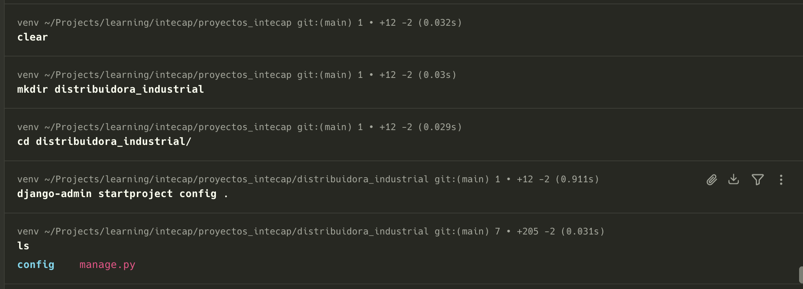

---

### 2. Crear la aplicación
Crear una aplicación de Django llamada: **`Productos`**

```bash
python manage.py startapp Productos
```

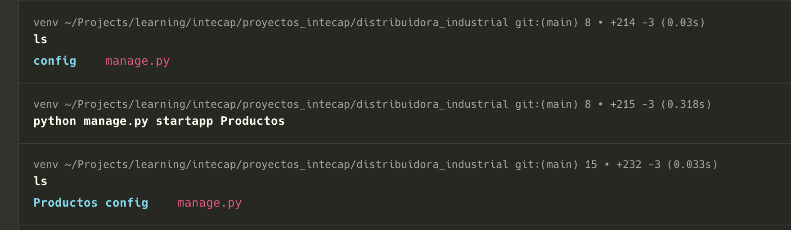

---

### 3. Crear el modelo `Producto`
El modelo deberá registrar las siguientes propiedades:

* **3.1. Código:** Texto corto con un máximo de 10 caracteres.
* **3.2. Nombre:** Texto corto con un máximo de 100 caracteres.
* **3.3. Presentación:** Texto corto con un máximo de 150 caracteres.
* **3.4. Costo de compra:** Número con decimales.
* **3.5. Precio de venta:** Número con decimales.

#### 📊 Especificación del Modelo

| Propiedad | Tipo de dato | Máximo caracteres | Ejemplo |
| :--- | :--- | :---: | :--- |
| **Código** | Texto corto | 10 | `PROD-00123` |
| **Nombre** | Texto corto | 100 | `Laptop Gamer` |
| **Presentación** | Texto corto | 150 | `Caja negra` |
| **Costo de compra** | Número con decimales | N/A | `750.99` |
| **Precio de venta** | Número con decimales | N/A | `1250.50` |

#### 💻 Implementación de la clase (`Productos/models.py`)

```python
from django.db import models

# Create your models here.
class Producto(models.Model):
    codigo = models.CharField(max_length=10)
    nombre = models.CharField(max_length=100)
    presentacion = models.CharField(max_length=150)
    costo_compra = models.DecimalField(max_digits=10, decimal_places=2)
    precio_venta = models.DecimalField(max_digits=10, decimal_places=2)

    def __str__(self):
        return self.nombre
```

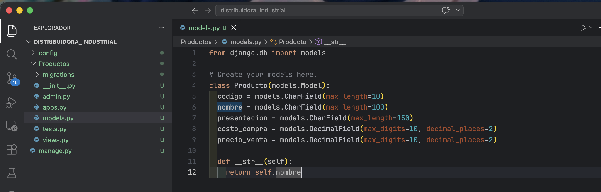

---

### 4. Preparar y aplicar las migraciones correspondientes

```bash
python manage.py makemigrations
python manage.py migrate
```

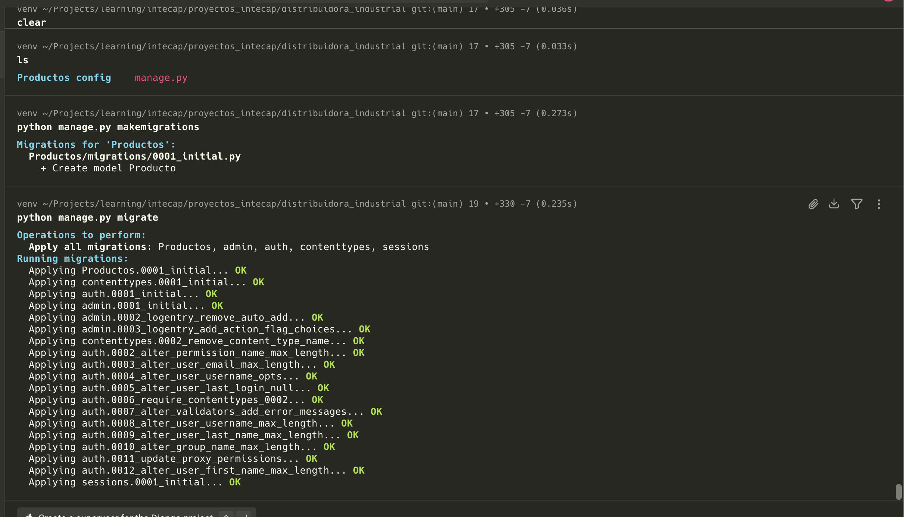
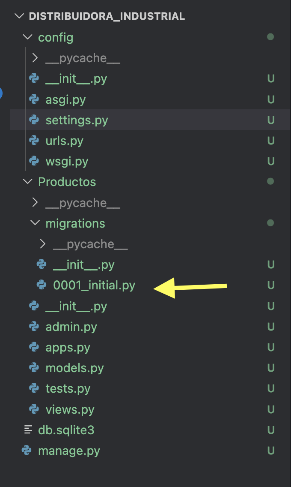

---

### 5. Acceder a la Shell de Django y ejecutar operaciones
Acceder a la Shell de Python con Django:

```bash
python manage.py shell
```

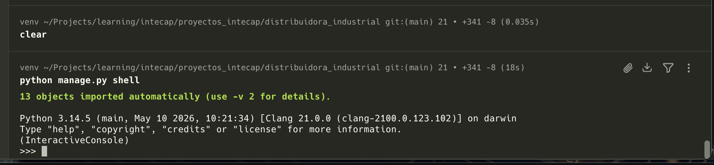

A continuación, ejecute las siguientes operaciones dentro del entorno interactivo:

#### 5.1 Crear al menos 5 productos

```python
from Productos.models import Producto

Producto.objects.create(codigo='P001', nombre='Laptop', presentacion='Caja', costo_compra=800.00, precio_venta=1200.00)
Producto.objects.create(codigo='P002', nombre='Mouse', presentacion='Blister', costo_compra=15.00, precio_venta=25.00)
Producto.objects.create(codigo='P003', nombre='Teclado', presentacion='Caja', costo_compra=35.00, precio_venta=60.00)
Producto.objects.create(codigo='P004', nombre='Monitor', presentacion='Caja', costo_compra=250.00, precio_venta=350.00)
Producto.objects.create(codigo='P005', nombre='Audífonos', presentacion='Blister', costo_compra=20.00, precio_venta=45.00)
print("5 productos creados")
```

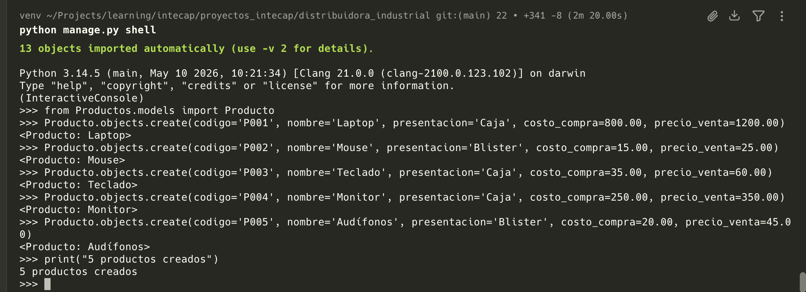

#### 5.2 Listar todos los productos con sus datos visibles

```python
from Productos.models import Producto
print(Producto.objects.all().values())
```

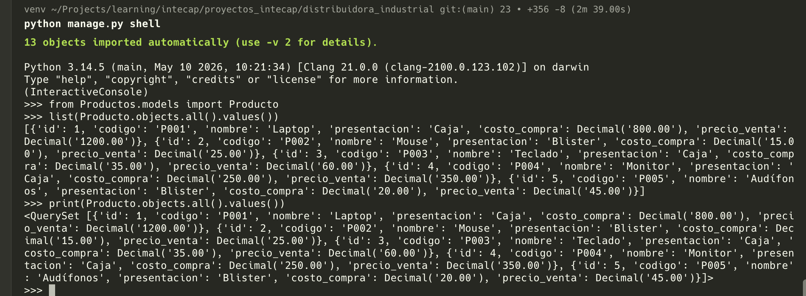

#### 5.3 Modificar al menos un producto

```python
Producto.objects.filter(codigo='P002').update(nombre='Mouse Gaming', precio_venta=35.00)
print("Producto modificado")

Producto.objects.filter(codigo='P002').values()
```

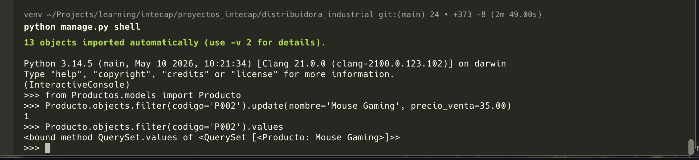

#### 5.4 Eliminar al menos un producto

```python
Producto.objects.filter(codigo='P005').delete()
print("Producto eliminado")

Producto.objects.filter(codigo='P002').exists()
```

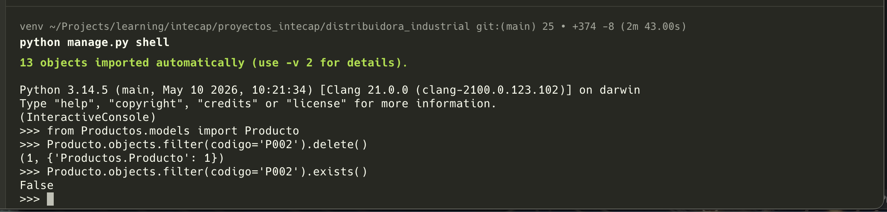

#### 5.5 Consultar los productos cuyo precio de venta sea mayor que 100

```python
Producto.objects.filter(precio_venta__gt=100)

# Usar values_list() con todos los campos de la consulta
Producto.objects.filter(precio_venta__gt=100).values_list()
```

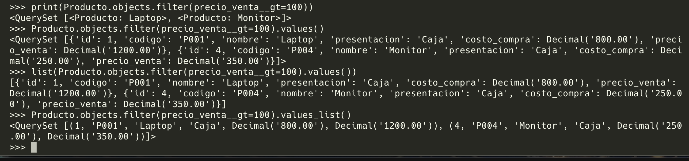
