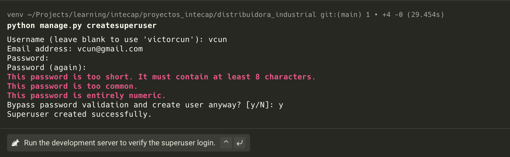
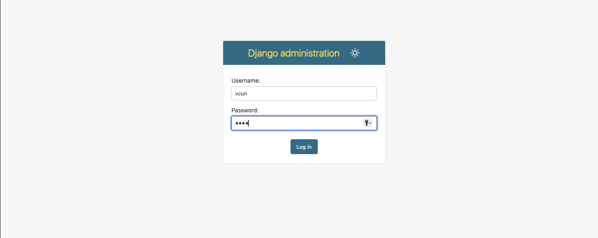
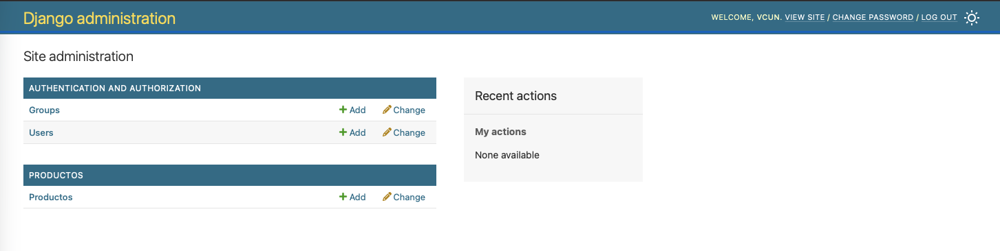
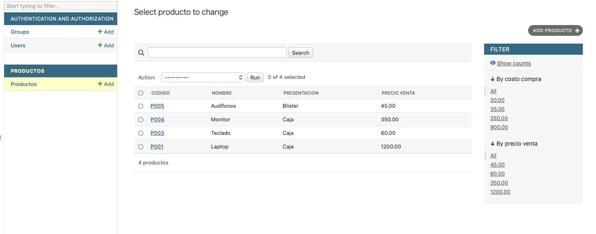
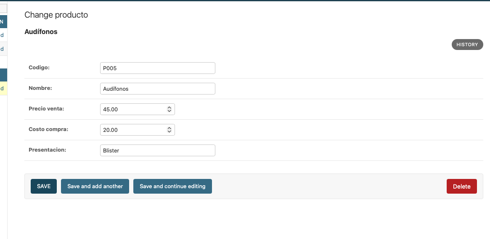

# Caso: Modelo de Producto para Distribuidora Industrial

Seguimos con la hoja de trabajo de Distribuidora Industrial. En esta guía se detalla la configuración del panel administrativo de Django para el modelo `Producto`.

---

## 🛠️ Paso 5: Crear un Superusuario para el Sitio de Django

Para poder acceder al panel de administración de Django, primero debemos crear un usuario administrador utilizando la interfaz de línea de comandos.

Ejecuta el siguiente comando en tu terminal:
```shell
python manage.py createsuperuser
```

> [!NOTE]
> Durante la ejecución, la consola te solicitará ingresar un nombre de usuario, dirección de correo electrónico y contraseña.



Una vez creado exitosamente, puedes acceder al panel de administración utilizando la siguiente dirección:
🌐 **URL de Administración:** [http://127.0.0.1:8000/admin/](http://127.0.0.1:8000/admin/)



---

## 📝 Paso 6: Registrar el Modelo de Producto

Para que el modelo `Producto` esté disponible y pueda ser gestionado desde el panel de Django, debemos registrarlo en el archivo `admin.py` de la aplicación correspondiente.

### Archivo: `Productos/admin.py`

```python
from django.contrib import admin
from .models import Producto

@admin.register(Producto)  # Registro mediante el decorador @admin.register
class ProductoAdmin(admin.ModelAdmin):
    pass

# Opción alternativa directa para registrar sin decorador:
# admin.site.register(Producto, ProductoAdmin)
```



---

## ⚙️ Pasos 7 y 8: Personalización de la Interfaz Administrativa

A continuación, personalizaremos la forma en que se muestran y editan los productos para mejorar la experiencia y eficiencia del usuario administrador.

### Requerimientos de Personalización:

#### **7. Personalización de la Vista de Lista (List View)**
* **7.1. Columnas a mostrar:** Código, Nombre, Presentación y Precio de venta.
* **7.2. Buscador habilitado para:** Código, Nombre y Presentación.
* **7.3. Filtros laterales por:** Precio de compra (`costo_compra`) y Precio de venta.

#### **8. Personalización del Formulario de Creación / Edición**
* **Campos del formulario ordenados de forma específica:** Código, Nombre, Precio de venta, Precio de compra y Presentación.

---

### Código Final Implementado

Actualiza el archivo `Productos/admin.py` con la siguiente configuración:

```python
from django.contrib import admin
from .models import Producto

@admin.register(Producto)
class ProductoAdmin(admin.ModelAdmin):
    # 7.1. División por columnas en la lista de registros
    list_display = ['codigo', 'nombre', 'presentacion', 'precio_venta']

    # 7.2. Habilitar la barra de búsqueda por campos específicos
    search_fields = ['codigo', 'nombre', 'presentacion']

    # 7.3. Agregar filtros en la barra lateral derecha
    list_filter = ['costo_compra', 'precio_venta']

    # 8. Orden específico de los campos dentro del formulario de creación/edición
    fields = ['codigo', 'nombre', 'precio_venta', 'costo_compra', 'presentacion']
```

---

### 🖥️ Demostración de las Vistas Personalizadas

#### **Vista de Lista Personalizada**
Muestra el listado de productos con sus columnas correspondientes, barra de búsqueda en la parte superior y filtros en el panel lateral derecho.



#### **Formulario de Creación / Edición Ordenado**
El formulario muestra los campos exactamente en el orden solicitado: Código, Nombre, Precio de venta, Precio de compra y Presentación.




