# Caso Práctico: Módulo de Clientes para Studio M

Studio M requiere el desarrollo de un módulo para administrar su cartera de clientes a través de una aplicación web construida con Django. A continuación, se detalla el proceso paso a paso para la configuración, desarrollo y validación del módulo.

---

## 1. Crear un Entorno Virtual de Python
Se procede a configurar un entorno virtual exclusivo para el proyecto con el fin de aislar y gestionar las dependencias necesarias.

```bash
# Crear el entorno virtual
python3 -m venv venv

# Activar el entorno virtual
source venv/bin/activate
```

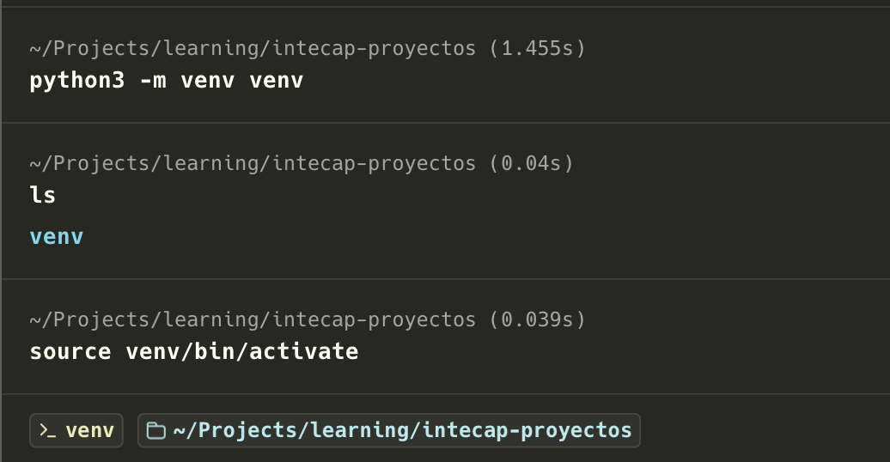

---

## 2. Crear un Proyecto de Django
Una vez activado el entorno virtual, creamos el directorio raíz del proyecto e inicializamos el proyecto de Django utilizando `django-admin`.

```bash
# Crear directorio del proyecto
mkdir proyecto_clienteStudioM
cd proyecto_clienteStudioM

# Inicializar el proyecto en el directorio actual
django-admin startproject config .
```

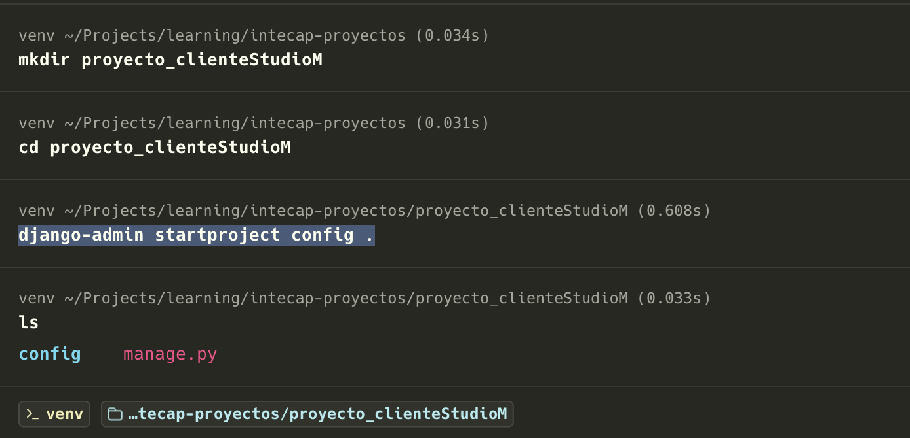

---

## 3. Crear la App (Módulo de Clientes)
Creamos la aplicación específica de Django que contendrá la lógica del módulo de administración de clientes.

```bash
python manage.py startapp clientes
```

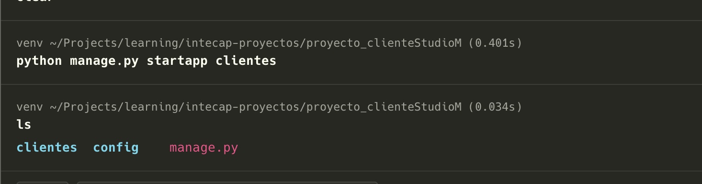

### Registrar la Aplicación en el Proyecto
Es necesario registrar la nueva aplicación `clientes` dentro de la configuración del proyecto. Modificamos el archivo `config/settings.py` para incluirla en la lista `INSTALLED_APPS`:


```python
# config/settings.py

INSTALLED_APPS = [
    'django.contrib.admin',
    'django.contrib.auth',
    'django.contrib.contenttypes',
    'django.contrib.sessions',
    'django.contrib.messages',
    'django.contrib.staticfiles',
    
    # Nueva aplicación registrada
    'clientes',  
]
```

---

## 4. Crear el Modelo de Cliente
Definimos la entidad `Cliente` como una clase dentro de la aplicación de Django.

## 5. Definir los Atributos del Cliente
El modelo `Cliente` debe cumplir estrictamente con los tipos de datos y especificaciones solicitados por Studio M:

- **DPI**: Texto, exactamente de 13 caracteres, único (`unique=True`).
- **Nombres**: Texto, de hasta 100 caracteres.
- **Apellidos**: Texto, de hasta 100 caracteres.
- **Fecha de Nacimiento**: Campo de tipo fecha (`DateField`).
- **Teléfono**: Texto, de hasta 15 caracteres.
- **Dirección**: Texto de residencia, de hasta 100 caracteres.
- **Correo Electrónico**: Dirección de correo, de hasta 100 caracteres.
- **Activo**: Estado lógico booleano (`BooleanField`), activo por defecto.

Implementamos estas especificaciones en el archivo `clientes/models.py`:

```python
# clientes/models.py
from django.db import models

class Cliente(models.Model):
    # 5.1. DPI (texto, exactamente 13 caracteres)
    dpi = models.CharField(max_length=13, unique=True, verbose_name="DPI")
    
    # 5.2. Nombres (texto, hasta 100 caracteres)
    nombres = models.CharField(max_length=100, verbose_name="Nombres")
    
    # 5.3. Apellidos (texto, hasta 100 caracteres)
    apellidos = models.CharField(max_length=100, verbose_name="Apellidos")
    
    # 5.4. Fecha de nacimiento (fecha)
    fecha_nacimiento = models.DateField(verbose_name="Fecha de Nacimiento")
    
    # 5.5. Teléfono (texto, hasta 15 caracteres)
    telefono = models.CharField(max_length=15, verbose_name="Teléfono")
    
    # 5.6. Dirección de residencia (texto, hasta 100 caracteres)
    direccion = models.CharField(max_length=100, verbose_name="Dirección de Residencia")
    
    # 5.7. Dirección de correo electrónico (texto, hasta 100 caracteres)
    correo_electronico = models.EmailField(max_length=100, verbose_name="Correo Electrónico")
    
    # 5.8. Activo (booleano)
    activo = models.BooleanField(default=True, verbose_name="Activo")

    def __str__(self):
        return f"{self.nombres} {self.apellidos} ({self.dpi})"

    class Meta:
        verbose_name = "Cliente"
        verbose_name_plural = "Clientes"
```

---

## 6. Preparar el Sitio Administrativo
Para poder utilizar el sitio de administración de Django, primero debemos generar y ejecutar las migraciones en la base de datos y, posteriormente, crear el primer superusuario.

```bash
# Generar archivos de migración para el modelo
python manage.py makemigrations

# Aplicar las migraciones a la base de datos
python manage.py migrate

# Crear la cuenta de superusuario administrador
python manage.py createsuperuser
```

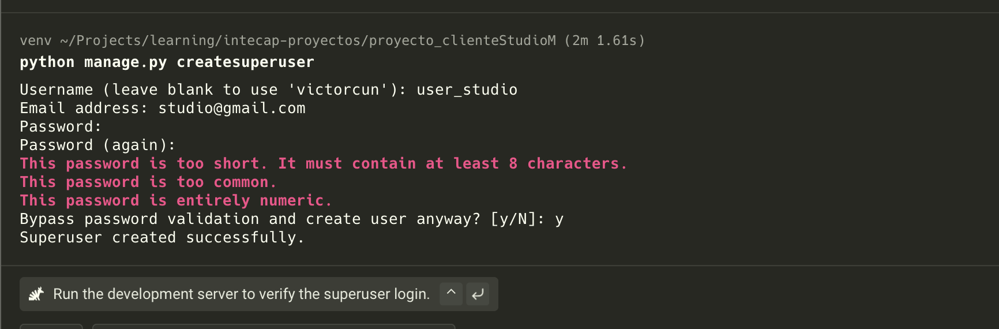

Una vez iniciado el servidor de desarrollo (`python manage.py runserver`), accedemos a la interfaz de administración en `http://127.0.0.1:8000/admin/`:

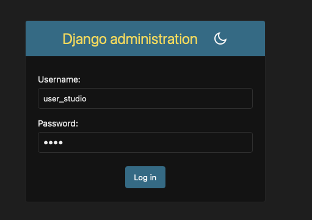

---

## 7. Registrar el Modelo de Cliente en el Sitio Administrativo
## 8. Crear la Clase de Administración Personalizada
## 9. Registrar la Clase de Administración
Para dotar al administrador de herramientas avanzadas y cumplir con los requerimientos específicos de personalización de Studio M, configuramos el archivo `clientes/admin.py` definiendo la clase `ClienteAdmin`:

- **8.1. Columnas en lista**: Visualizar DPI, nombres, apellidos y teléfono.
- **8.2. Búsqueda**: Habilitar búsqueda por DPI, nombres, apellidos y teléfono.
- **8.3. Filtrado**: Habilitar filtros laterales por fecha de nacimiento y estado (activo).
- **8.4. Edición rápida**: Permitir editar nombres, apellidos y teléfono directamente desde la lista.
- **8.5. Acción personalizada (Inactivar)**: Acción en lote para marcar clientes seleccionados como inactivos.
- **8.6. Acción personalizada (Activar)**: Acción en lote para marcar clientes seleccionados como activos.

```python
# clientes/admin.py
from django.contrib import admin
from .models import Cliente

# 8.5. Acción personalizada para inactivar registros en lote
@admin.action(description='Inactivar los clientes seleccionados')
def inactivar_clientes(modeladmin, request, queryset):
    queryset.update(activo=False)

# 8.6. Acción personalizada para activar registros en lote
@admin.action(description='Activar los clientes seleccionados')
def activar_clientes(modeladmin, request, queryset):
    queryset.update(activo=True)


# 8. Clase de Administración Personalizada
class ClienteAdmin(admin.ModelAdmin):
    # 8.1. Columnas visibles en la vista de lista
    list_display = ('dpi', 'nombres', 'apellidos', 'telefono', 'activo')
    
    # 8.2. Campos para la barra de búsqueda rápida
    search_fields = ('dpi', 'nombres', 'apellidos', 'telefono')
    
    # 8.3. Filtros laterales de búsqueda
    list_filter = ('fecha_nacimiento', 'activo')
    
    # 8.4. Columnas editables directamente desde la vista de lista
    list_editable = ('nombres', 'apellidos', 'telefono')
    
    # Registro de las acciones en lote personalizadas (8.5 y 8.6)
    actions = [inactivar_clientes, activar_clientes]


# 7 y 9. Registro del Modelo junto con su configuración de Administración
admin.site.register(Cliente, ClienteAdmin)
```

---

## 10. Pruebas de Funcionamiento en el Panel de Administración

### 10.1. Crear 3 Clientes
Se realiza el registro de 3 clientes de prueba a través del formulario de creación y se verifica su correcta inserción en la vista de lista.

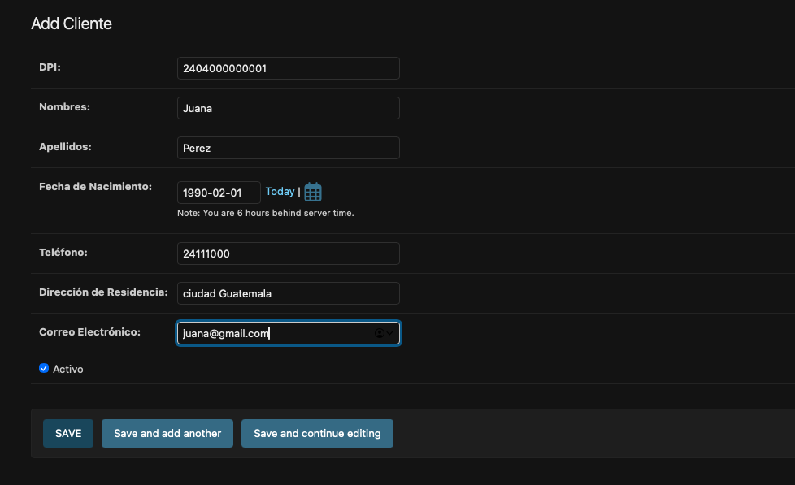
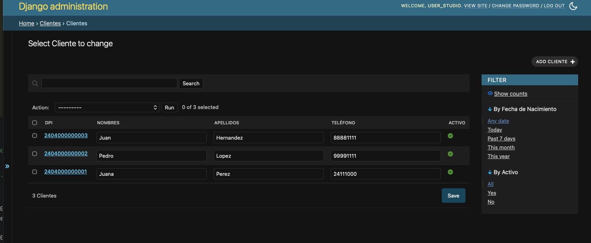

### 10.2. Modificar 1 Cliente (Estado Inactivo)
Se cambia el estado de uno de los clientes a **Inactivo** (Activo = Falso) usando la edición rápida y se prueban las acciones personalizadas para la activación/inactivación en lote.

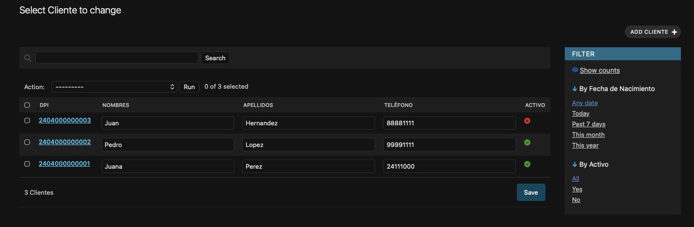
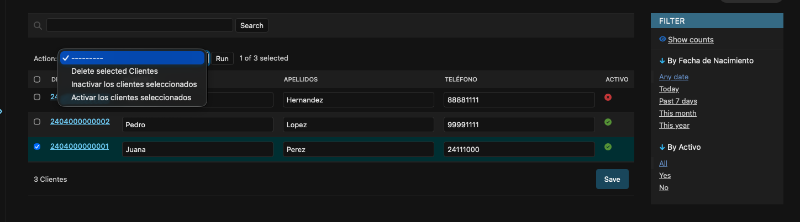

### 10.3. Eliminar 1 Cliente
Se procede a eliminar un registro de cliente de la base de datos para confirmar que la acción funciona correctamente.

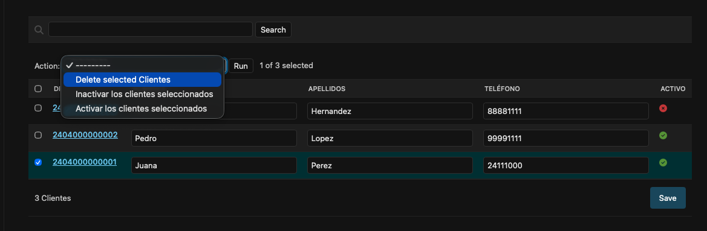
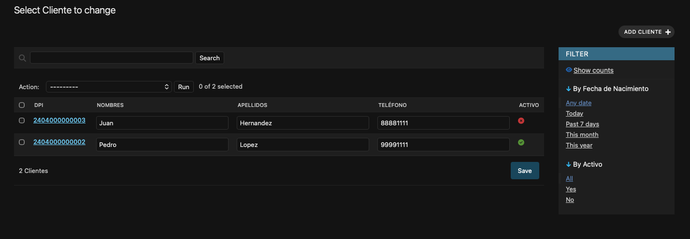
